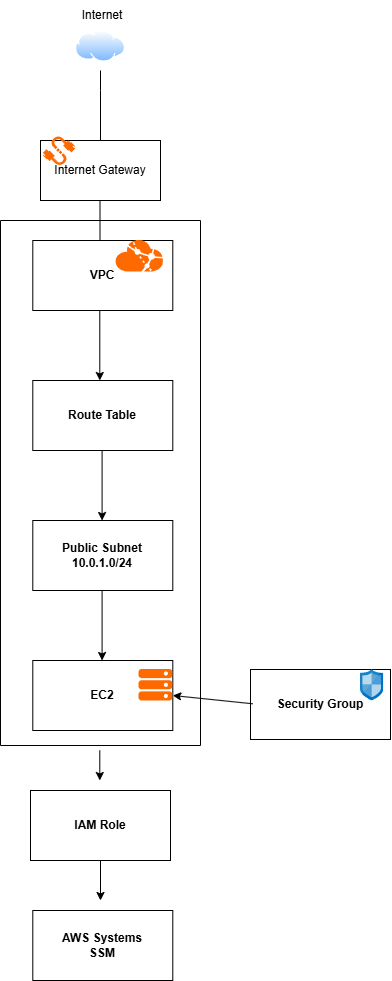
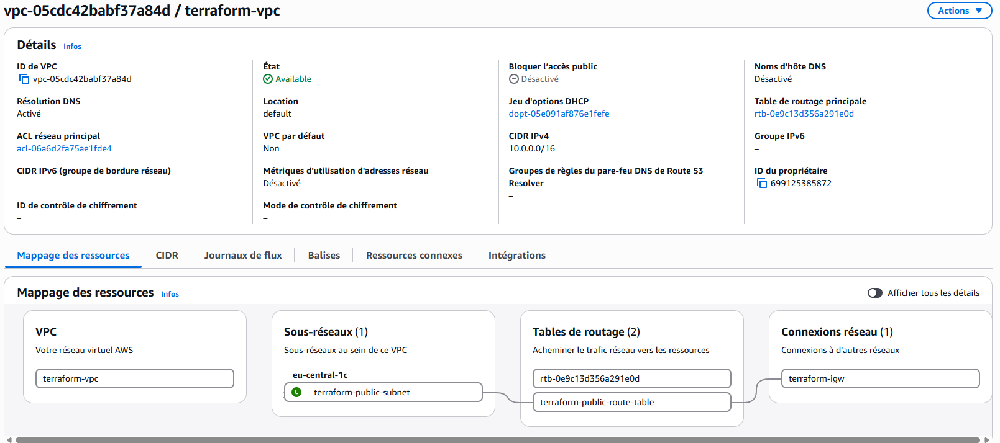
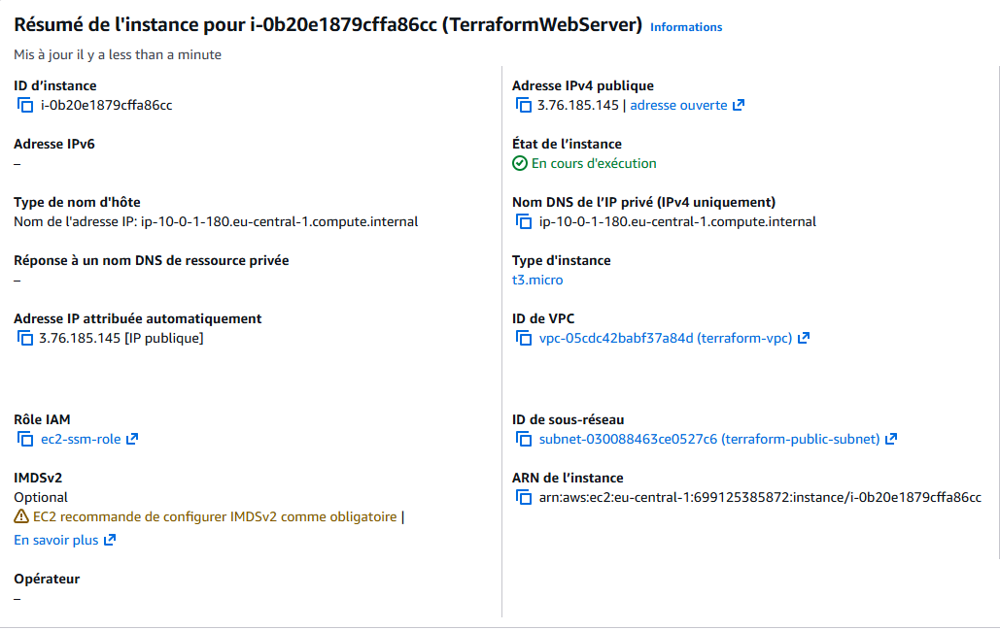
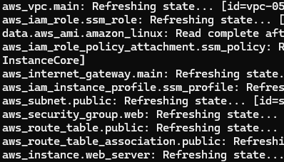
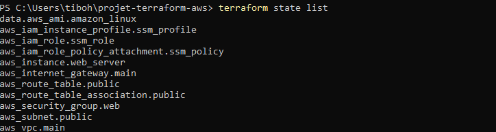
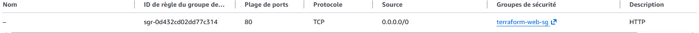
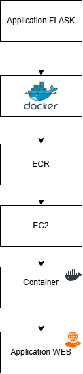

## 📌 Terraform AWS DevOps Project

## Tableau des Contenus

- [Présentation du projet](#1-Présentation-du-projet)

- [Objectifs](#2-objectifs)
  
- [Architecture](#3-Archiecture)

- [Technologies utilisées](#4-Technologies-utilisées)

- [Infrastructure AWS](#5-Infrastructure-AWS)

- [Structure du projet](#6-Structure-du-projet)

- [Prérequis](#7-Prérequis)

- [Configuration AWS](#8-Configuration-AWS)

- [Déploiement avec Terraform](#9-Déploiement-avec-Terraform)

- [Vérification](#10-Vérification)

- [Sécurité](#11-Sécurité)

- [Docker](#12-Docker)

- [Ce que j'ai appris](#13-Ce-que-j'ai-appris)

##  1. Présentation du projet

Ce projet personnel a pour objectif de mettre en pratique les principes DevOps à travers le déploiement et l'automatisation d'une infrastructure AWS avec Terraform.

L'infrastructure comprend actuellement un VPC, un subnet public, une Internet Gateway, une table de routage, un Security Group et une instance EC2.

Le projet évoluera progressivement avec l'intégration de Docker, Ansible et GitHub Actions.

## 2. Objectifs

- Découvrir et mettre en pratique l'Infrastructure as Code
- Apprendre à utiliser Terraform avec AWS
- Comprendre la mise en place d'un réseau AWS
- Déployer une instance EC2 de manière automatisée
- Mettre en place des règles de sécurité avec Security Groups
- Utiliser IAM et AWS Systems Manager
- Versionner l'infrastructure avec Git et GitHub
- Automatiser progressivement le déploiement d'une application

## 3. Architecture

EC2 (Elastic Compute Cloud) est la machine virtuelle qui exécute notre application ou nos services.

L'instance possède généralement :

Private IP : 10.0.1.10
Public IP  : 3.x.x.x

La Private IP permet la communication à l'intérieur du VPC.

La Public IP permet à l'instance d'être adressable depuis Internet lorsque la configuration réseau et les règles de sécurité l'autorisent.

Le trafic vers l'EC2 passe par le Security Group.

Voir [Infrastructure AWS](#5-Infrastructure-AWS)

                      
## 4. Technologies utilisées

- Terraform
- Amazon Web Services (AWS)
- Amazon EC2
- Amazon VPC
- IAM
- AWS Systems Manager
- Git
- GitHub

### À venir

- Ansible
- Gitlab CI/CD
- Monitoring
- Kubernetes

## 5. Infrastructure AWS

### VPC (Virtual Private Cloud)
Le VPC est le réseau privé de mon infrastructure AWS.
Il permet d'isoler et d'organiser les ressources réseau du projet.

Un VPC dédié nommé `terraform-vpc` a été créé avec Terraform.

Il utilise le bloc d'adresses IPv4 :

`10.0.0.0/16`

Le VPC contient un subnet public dans lequel est déployée l'instance EC2.

Le mappage des ressources permet également de visualiser les différents composants réseau associés au VPC, notamment :

- le subnet public `terraform-public-subnet`
- les tables de routage
- l'Internet Gateway `terraform-igw`
  

### Subnet public
Le subnet est une subdivision du VPC dans laquelle est déployée l'instance EC2.
Il est configuré comme public afin de permettre à l'instance de communiquer avec Internet.

CIDR : `10.0.1.0/24`

### Internet Gateway
L'Internet Gateway permet la communication entre le VPC et Internet.
Elle est utilisée par le subnet public pour permettre les connexions Internet.

### Route Table
La table de routage définit comment le trafic réseau doit être acheminé.
Dans mon projet, une route `0.0.0.0/0` dirige le trafic Internet vers l'Internet Gateway.

### Route Table Association
Cette association relie la Route Table au subnet public.
Elle permet donc au subnet d'utiliser les règles de routage définies.

### Security Group
Le Security Group agit comme un pare-feu virtuel pour l'instance EC2.
Il contrôle le trafic réseau entrant et sortant de l'instance.

Dans ce projet, le trafic HTTP sur le port `80` est autorisé afin de permettre l'accès à l'application web.

### EC2 (Elastic Compute Cloud)
EC2 fournit une machine virtuelle dans AWS.
Elle constitue le serveur sur lequel seront déployés les futurs services du projet.

L'instance est déployée dans le subnet public et utilise le Security Group défini par Terraform.
 

### IAM Role
Le rôle IAM définit les permissions accordées à l'instance EC2.
Il permet notamment à l'instance d'utiliser certains services AWS sans stocker directement de credentials AWS sur la machine.

### IAM Instance Profile
L'Instance Profile permet d'associer le rôle IAM à l'instance EC2.
Il permet donc à l'instance d'utiliser les permissions définies dans le rôle IAM.

### AWS Systems Manager (SSM)
AWS Systems Manager permet d'administrer l'instance EC2 à distance.
Dans ce projet, il permet notamment d'accéder à l'instance sans avoir besoin d'exposer publiquement le port SSH `22`.

## 6. Structure du projet

📁 terraform-aws-devops-project/
 -   📄 .gitignore
  -  📄 terraform.lock.hcl
  -  📄 README.md
   - 📄 main.tf
   - 📄 outputs.tf
   - 📄 variables.tf
    
📁 screenshots/
   - 📄aws-ec2.png
   - 📄aws-securitygroup.png
   - 📄aws-vpc.png
   - 📄terraform-state.png
   - 📄terraformplan.png

### 📄 `.gitignore`
Définit les fichiers et dossiers qui ne doivent pas être envoyés sur GitHub.

Il permet notamment d'exclure le dossier `.terraform/`, les fichiers de state Terraform et les fichiers contenant des variables sensibles.

### 📄 `terraform.lock.hcl`
Fichier généré par Terraform qui verrouille les versions des providers utilisés par le projet.
Il permet notamment de garantir que Terraform utilise les mêmes versions de providers lors des différentes exécutions.

### 📄 `main.tf`
Contient la définition principale de l'infrastructure AWS.
Il contient notamment le provider AWS, le VPC, le subnet, l'Internet Gateway, la Route Table, le Security Group, l'instance EC2 et les ressources IAM.

### 📄 `variables.tf`
Contient la déclaration des variables utilisées par Terraform.
Il permet d'éviter de mettre directement certaines valeurs dans les ressources et facilite la réutilisation de la configuration.

### 📄 `outputs.tf`
Contient les informations que Terraform doit retourner après le déploiement de l'infrastructure.
Il peut par exemple permettre d'afficher l'ID ou l'adresse IP publique de l'instance EC2.

## 7. Prérequis

- Terraform
- AWS CLI
- Un compte AWS
- Git
- Un compte GitHub

## 8. Configuration AWS

## 9. Déploiement avec Terraform

Avant d'appliquer les modifications, `terraform plan` permet de
visualiser les ressources qui seront créées ou modifiées.

Les étapes permettant de visualiser la configuration , les changements effectués par Terrafom afin de les déployés sur AWS. 

- init → initialise Terraform et télécharge le provider.
- validate → vérifie la configuration.
- plan → montre les changements prévus.
- apply → applique les changements sur AWS.

## 10. Vérification

Afin de vérifier que l'infrastructure fonctionne correctement , la commande suivante permet de voir les ressources actuellement
suivies par Terraform 'terraform state list' :

 

## 11. Sécurité

- Les fichiers `terraform.tfstate` et `terraform.tfvars` sont exclus du repository.
- Les credentials AWS ne sont pas stockés dans GitHub.
- L'accès à l'instance est réalisé via AWS Systems Manager.
- Le port SSH 22 n'est pas exposé publiquement.
- Le Security Group autorise actuellement uniquement le trafic HTTP nécessaire à l'application.

## 12. Docker

🐳 Docker sur AWS EC2

Docker a été installé et configuré sur une instance Amazon EC2 afin de permettre l'exécution et le déploiement de conteneurs.

### Application web

L'application web a été développée avec Python / Flask, puis conteneurisée avec Docker afin de garantir un environnement d'exécution reproductible.

### Architecture

Création de l'image Docker : 

L'image est construite à partir du Dockerfile 

docker build -t devops-app .

Vérification de l'image :

docker images

Exécution du conteneur : 

L'application est exécutée dans un conteneur Docker et exposée sur le port 80 

docker run -d -p 80:80 --name devops-app devops-app

Vérification du conteneur :

docker ps

L'application peut ensuite être testée avec :

curl http://localhost

ou depuis un navigateur :

http://<PUBLIC-IP-EC2>
Publication de l'image dans Amazon ECR

L'image Docker est ensuite publiée dans un repository Amazon ECR.

Connexion à ECR :

aws ecr get-login-password --region eu-central-1 \
| docker login --username AWS --password-stdin \
699125385872.dkr.ecr.eu-central-1.amazonaws.com

Tag de l'image :

docker tag devops-app \
699125385872.dkr.ecr.eu-central-1.amazonaws.com/hello-repository:latest

Push vers ECR :

docker push \
699125385872.dkr.ecr.eu-central-1.amazonaws.com/hello-repository:latest

## 13. Ce que j'ai appris

Ce projet m'a permis de mettre en pratique :

- le principe d'Infrastructure as Code ;
- la syntaxe et le fonctionnement de Terraform ;
- la gestion des providers et des ressources ;
- la création d'un réseau AWS avec VPC ;
- la création de subnets et de tables de routage ;
- la gestion du trafic avec les Security Groups ;
- le déploiement d'une instance EC2 ;
- la gestion des permissions avec IAM ;
- l'utilisation d'AWS Systems Manager ;
- le versionnement d'un projet avec Git et GitHub.

